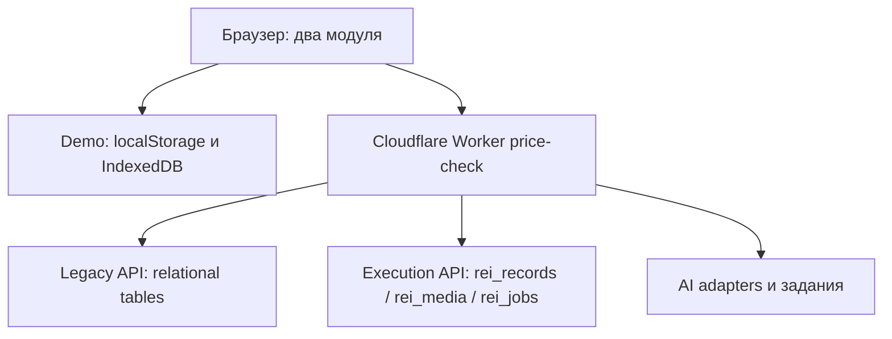

# Price Validation / Planogram Check — техническая документация для Claude

Дата подготовки: 24 сентября 2026. Формат: передача проекта разработчику для сопровождения кода, API и базы данных.

Документ описывает существующую реализацию и технические процедуры обслуживания. Он не определяет ассортимент, коммерческие правила или оптимальную выкладку. Изменения бизнес-данных должны опираться на предоставленный владельцем утверждённый источник.

## 1. Как передать проект Claude

Прикрепите этот файл, предоставьте Claude доступ к репозиторию и отдельно — необходимые права Cloudflare. Документ не содержит токенов и не предоставляет доступ сам по себе.

Готовая вводная для новой сессии:

> Ты сопровождаешь проект agv747/test: Cloudflare Worker price-check, модули Price Validation и Planogram Check. Прочитай приложенную документацию, затем актуальные AGENTS.md, конфигурацию и исходники. Сначала установи текущий commit, рабочую ветку, адрес целевого приложения и D1 binding. Не считай сведения о последней загрузке данных независимо проверенными. Различай browser demo, relational tables и private workspace JSON. Перед изменениями данных сохрани восстановимую резервную копию и покажи сводку изменений. Используй существующие API и доменные обработчики с реальными правами; не отключай авторизацию, проверки ревизий или валидацию. Не запускай seed для обновления рабочего каталога. Не меняй код, если задача касается только поддерживаемой операции с данными. Если существующий API не поддерживает нужное изменение, явно объясни ограничение и предложи минимальную проверяемую миграцию или доработку. После работы предоставь diff, результат проверок, состояние базы до/после, способ отката и точную ссылку на проверенную версию. Выполни следующую задачу: [вставить задачу].

Для работы нужны: чтение/запись GitHub при изменениях кода; доступ Cloudflare к правильному Worker и D1; административная сессия приложения для закрытых API; доступ к секретам только при задачах, которым он необходим. Секреты передавать через защищённые настройки, не в README, чат, коммит или скриншот.

## 2. Паспорт и достоверность сведений

| Параметр | Значение |
| --- | --- |
| Репозиторий | https://github.com/agv747/test |
| Последняя подтверждённая основная ветка | `claude/tic-tac-toe-cloudflare-vfhfd7` |
| Проверенный базовый commit | `7b62f998864c48d98188117a9f3ae128d40170e3` |
| Изменение в этом commit | Merge PR #18, названия модулей Price Validation / Planogram Check |
| Worker | `price-check` |
| Основной адрес | https://price-check.anton-grebelny.workers.dev |
| Последний известный preview | https://4183ab67-price-check.anton-grebelny.workers.dev |
| Известный alias preview | https://claude-tic-tac-toe-cloudflare-vfhfd7-price-check.anton-grebelny.workers.dev |
| D1 binding | `DB` |
| D1 database_name | `retail-price-intelligence` |
| D1 database_id | `9fabe7e1-fb10-455b-adf8-15bcb16a8f5d` |
| package name / version | `retail-price-intelligence-sg` / `3.0.0` |

Названия ветки и npm-пакета исторические. Они не означают, что надо переименовать Worker или развернуть другой проект. В аккаунте могут быть другие Worker, включая `test` и `tic-tac-toe`: это не цель данного документа.

Исходники сверены с локальным деревом, совпадающим по содержимому с указанным базовым commit. Данные production независимо не выгружены. При предыдущей проверке основной `/api/execution/session` возвращал 404, а ряд других запросов к основному/preview адресам — 403 из среды проверки. Эти ответы не доказывают ни пустоту D1, ни правильность актуального деплоя. Перед работой проверить всё заново.

Последнее известное успешное выполнение набора тестов: 407 тестов в предыдущей работе с кодом. При подготовке этой документации тесты заново не запускались. Реальные обращения ко всем AI-провайдерам не подтверждены.

### Сообщённое состояние D1 после работы Claude

Следующие числа взяты из отчёта, предоставленного пользователем, а не из независимого чтения production:

| Объект | Сообщённое состояние |
| --- | --- |
| Workspace | `rei_records`, `kind='workspace'`, `id='TW'`, `revision=1` |
| Каталог | 56 SKU |
| Оборудование | 3 fixtures, сетка 7 × 30 |
| План | код `TW-CVS-COUNTER-7X30`, published, 210 позиций |
| Assignments | 3 |
| JSON payload | 46 116 символов / 46 182 UTF-8 байта |
| Медиа и задания | По отчёту не изменялись |
| Код и схема | По отчёту не изменялись |

Отчёт описывает прямую запись D1, локальную сборку через `applyCommand`, временную staging-запись и последующее её удаление. Это история операции, а не предписание повторять такой способ. Локальная доменная проверка не заменяет проверку прав на сервере или административный контроль доступа к БД.

Упомянутый SHA-256 `4b1c2e34…` сокращён: он непригоден для полного криптографического сравнения. Длины разделов тоже не доказывают идентичность содержимого. Для новой проверки вычислить полный SHA-256 из точных исходных байтов.

Распределение вариантов по позициям, по отчёту, иллюстративное. Статус `published` означает состояние объекта в программе, а не подтверждение бизнес-владельцем точности эталона. Сохранить эту оговорку в данных и документации; не заменять неизвестные сведения догадками.

## 3. Архитектура

Приложение — статический frontend на ES modules и Cloudflare Worker backend. Обычного frontend build нет: каталог `public/` публикуется как assets. Worker принимает API, работает с D1 и запускает обработку AI-заданий по cron.



| Файл / каталог относительно корня репозитория | Назначение |
| --- | --- |
| `worker.js` | Главный fetch router, legacy API, scheduled handler |
| `wrangler.toml` | Production bindings, assets, AI, cron |
| `wrangler.local.toml` | Локальная конфигурация без Workers AI binding |
| `public/app/main.js` | Оболочка, навигация, маршрутизация экранов |
| `public/app/module-navigation.js` | Названия и выбор модулей |
| `public/app/store.js` | Legacy store и browser session |
| `public/app/seed.js` | Демонстрационные исходные данные legacy-контура |
| `public/app/services/` | Legacy-сервисы и расчёты |
| `public/app/execution/domain.js` | Команды, права, проверки, reference resolution, оценки |
| `public/app/execution/client.js` | Private API client и переключение demo/shared |
| `public/app/execution/demo.js` | Локальный execution demo |
| `public/app/execution/catalogue.js` | Демонстрационный каталог |
| `public/app/execution/ui.js`, `demo-ui.js` | Экраны проверки и демо |
| `public/app/execution/ui-ai.js` | Экраны AI-настроек |
| `public/app/execution/ai-contracts.js` | AI-задачи и контракты |
| `public/app/execution/sg-provider.js` | Связь price-модуля с execution AI |
| `server/execution/api.js` | Закрытые HTTP endpoints |
| `server/execution/auth.js` | Токены, cookie, same-origin |
| `server/execution/storage.js` | Private DDL, revision-aware writes, медиа |
| `server/execution/credentials.js` | Шифрование и выдача credential DTO |
| `server/execution/adapters.js` | Провайдеры, endpoint validation, ответы и ошибки |
| `server/execution/jobs.js` | Durable jobs, leases, идемпотентность |
| `shared/schema.js` | Дескриптор relational schema, DDL, миграции, преобразования |
| `shared/recognition.js` | Общий код распознавания legacy-контура |
| `public/styles/app.css`, `execution.css` | Стили |
| `tests/` | Node test suite |
| `scripts/` | Local server, smoke, bundle, demo generators |
| `docs/` | Ранее написанные заметки о реализации и релизах |

Исторические документы `docs/CLOUDFLARE.md`, `REPO-INSPECTION`, `EXECUTION-RELEASE`, `GM-DEMO` полезны как контекст; при расхождении считать актуальные исходники и конфигурацию источником истины.

## 4. Модули и границы поддержки рынков

Пользовательские модули называются **Price Validation** и **Planogram Check**. Выбор модуля хранится отдельно от рынка, в `session.module`. Совместимость со старой сессией использует `session.market === 'TW'` для выбора planogram-модуля. Маршруты `#/tw/...` сохранены.

Переименование интерфейса не завершило многорыночную архитектуру. `readWorkspace()` по-прежнему читает ровно `workspace/TW`; `blankWorkspace`, права execution и ряд обработчиков привязаны к TW. AI task IDs: `sg_price_recognition` и `tw_planogram_recognition`; маршруты допускают SG/TW. Валюта, временная зона, каталог, права и локализация не становятся универсальными от смены текста кнопок.

Для настоящей поддержки дополнительных рынков нужна отдельная задача: контракт market context, ключ workspace, server-side scope, задания AI, cache keys, миграция существующих данных и тесты изоляции. Не делать глобальную замену строк `TW`/`SG` как способ такой миграции.

## 5. Локальный запуск и работа с кодом

Начать с `git status`, чтения применимых `AGENTS.md` и проверки remote. Не стирать пользовательские изменения. Для нового checkout:

```bash
git clone https://github.com/agv747/test.git
cd test
git fetch origin
git switch claude/tic-tac-toe-cloudflare-vfhfd7
git pull --ff-only
git switch -c maintenance/my-change
npm run toolchain
npm run dev:local
```

Использовать Node, совместимый с установленными Wrangler и Playwright. Версия toolchain не закреплена в `package.json`; сохранить фактически использованные версии в отчёте. Не добавлять зависимости и lockfile автоматически только из-за привычного шаблона другого проекта.

| Команда | Что делает / ограничение |
| --- | --- |
| `npm test` | `node --test "tests/*.test.js"` |
| `npm run build` | Сообщение об отсутствии build; не проверяет корректность приложения |
| `npm run dev:local` | Wrangler с локальной конфигурацией |
| `npm run dev` | Wrangler с основной конфигурацией; прежде проверить bindings |
| `npm run serve` | Static server; не поднимает настоящий закрытый backend |
| `npm run smoke` | Общий browser smoke |
| `npm run smoke:execution` | Execution browser smoke; по умолчанию static demo |
| `npm run bundle` | Генерация standalone bundle |
| `npm run demo:tw` | Генерация статических demo-файлов, не обновление D1 |
| `npm run demo-images` | Генерация demo-изображений |
| `npm run deploy` | `npx wrangler deploy`; это публикация, не локальная проверка |

Для браузерных smoke нужен установленный Chromium либо `CHROMIUM_PATH`; конкретный скрипт поддерживает также `CHROMIUM_ARGS`, `SMOKE_BASE` и `SHOTS`. Не указывать production как `SMOKE_BASE` без чтения сценария: smoke может выполнять действия, а не только открывать страницу. Синтетический smoke не доказывает работу private D1 или реального AI.

Локальные секреты не коммитить. Не подставлять remote D1 в локальную проверку по умолчанию. Конфигурация `wrangler.local.toml` не имеет AI binding; ожидаемое отсутствие реального AI локально не следует маскировать фальшивым успехом.

## 6. Три разных хранилища

| Контур | Где данные | Как читать / менять |
| --- | --- | --- |
| Browser demo Planogram Check | localStorage `rei.tw.demo.v1`, режим `rei.workspace.mode`; изображения в IndexedDB `rei-local-demo`, store `images` | Demo client и `applyCommand`; только этот браузер/origin |
| Private Planogram Check | `rei_records`, запись `(workspace,TW)`; медиа отдельно | `/api/execution/workspace`, `/commands`, специальные endpoints |
| Relational / legacy | Таблицы из `shared/schema.js`, включая `skus` | Legacy API и соответствующие repository/schema функции |

**Обновление `skus` не обновляет `workspace.catalogue`.** Добавление relational `planograms` также не создаёт запись в `workspace.plans`. Private tables намеренно исключены из `TABLE_NAMES` и `/api/data`.

15 демонстрационных позиций `TW-A`–`TW-O` в браузере и сообщённые 56 серверных SKU — разные наборы. Статические `public/demo/tw/setup.json` и файлы планов не являются экспортом live D1. Без входа пользователь может видеть demo, даже если серверная БД заполнена.

Preview и основной сайт — разные origins: cookie и browser storage не обязаны совпадать. При этом они могут использовать одну D1 через один binding: preview нельзя автоматически считать изолированной песочницей.

## 7. Private workspace: модель и ограничения

Начальная форма:

```json
{
  "schemaVersion": 1,
  "market": "TW",
  "catalogue": [],
  "fixtures": [],
  "plans": [],
  "assignments": [],
  "captures": [],
  "assessments": [],
  "issues": [],
  "events": []
}
```

Внешний SQL `revision` — ревизия всей записи. У планов и captures есть собственные ревизии. Это разные значения; API-команда может требовать обе. `applyCommand` клонирует workspace и возвращает новое состояние с результатом; backend записывает его атомарной заменой JSON с optimistic concurrency.

`writeRecord` ограничивает JSON каждой записи 1 500 000 UTF-8 байт. Для создания с expectedRevision=0 выполняется INSERT revision=1 с `ON CONFLICT DO NOTHING`; успешной считается ровно одна изменённая строка. Обновление выполняется только при совпадении revision и повышает его на 1. Конфликт — HTTP 409 `REVISION_CONFLICT`. Нельзя лечить его слепым повтором старого payload с новой ревизией: нужно перечитать и пересобрать изменение.

### Каталог и setup

Команда `setup` требует `planogram.manage`, принимает `catalogue` (до 2000 элементов в запросе) и `fixtures` (до 500). Это лимиты входного массива, а не гарантия суммарного размера существующего каталога.

Сохраняемые поля SKU: `id`, `code`, `name`, принудительный `market: 'TW'`, `artworks` (по умолчанию `[]`). ID соответствует `^[\w-]{1,80}$`; code максимум 80, name максимум 200 символов. Не полагаться только на слабые проверки длины: входной файл должен иметь корректные непустые строки и уникальные ID.

Setup **добавляет отсутствующие ID и пропускает уже существующие**. Он не обновляет название, artwork или иные поля существующего SKU. Возвращаемое `added: true` само по себе не доказывает, что строки добавились. Сверять ID и фактический diff.

Поля вроде `brand`, `gtin`, расширенной упаковки не сохраняются этим обработчиком автоматически. Перед расширением модели необходимо определить схему, сохранение, чтение, UI и миграцию. Нельзя обещать владельцу сохранение полей, которые handler отбрасывает.

### Fixtures, планы, привязки и история

Fixture хранит `id`, `outletId`, `outletName`, `name`, `territory`, `ownerId`, `rows`, `columns`, `type: 'regular_cabinet'`, `active: true`. В setup размеры — положительные целые, произведение не больше 500. Fixture ID также уникальный безопасный идентификатор. `ownerId` влияет на видимость для field-пользователя.

План: `code`, `rows`, `columns`, `fixtureType`, `slots`, `validFrom`, `validTo`, `requiredSkuIds`, `facingRules`, `changeNote`, `sourceName`, `sourceText`; служебные `id`, `lineageId`, `market`, `status`, `revision`, `version`, `updatedAt`, `updatedBy`, при публикации `publishedAt`.

Технические инварианты `validatePlan`:

- Каждое измерение от 1 до 50, всего до 500 ячеек.
- Все ячейки описаны, включая неактивные; координаты начинаются с 1.
- Ключ ячейки строго `R{row}C{column}`, без повторов.
- `active` — boolean; активная ячейка имеет непустой `allowedSkuIds`.
- Все ссылочные SKU существуют; `preferredSkuId`, если задан, входит в разрешённый список.
- Даты образуют действительный полуоткрытый интервал `[validFrom, validTo)`.
- Дополнительные ссылочные правила не содержат неизвестных ID; числовые ограничения проверяются доменом.

Публикация делает план неизменяемым для edit. Для следующей версии применяется duplicate, создающий draft той же lineage. Нельзя правкой JSON переписывать опубликованный эталон, на который опираются исторические captures.

Assignment: `id`, `fixtureId`, `planId`, `validFrom`, `validTo`. План должен быть published, тип и размеры совпадать с fixture, интервал входить в срок плана. Для одного fixture пересекающиеся интервалы запрещены.

Capture хранит fixture/outlet, время фактического снимка, source, mode, snapshot reference, images, reviews, revision и автора. Reference выбирается на момент capture. Изменение текущей привязки не должно переписывать старое доказательство.

Review различает `product`, `empty`, `unknown`; unknown не считать empty или автоматически исправной позицией. Подтверждённые наблюдения требуют primary evidence. Bounding box: `[x, y, width, height]`, нормализованные координаты 0–1, положительные размеры внутри изображения.

Assessment вычисляется серверной доменной логикой, а не принимается как готовый score от клиента. Submission использует idempotencyKey; повтор с тем же ключом и другим содержимым должен дать конфликт. Issues и events сохраняют историю действий; не удалять её как побочный эффект обновления справочника.

## 8. Авторизация и секреты

`APP_ACCESS_USERS_JSON` — массив `{token,id,name,role,markets}`. `ADMIN_ACCESS_TOKEN` добавляет Administrator с SG/TW. Допустимый токен: минимум 32 символа из `A–Z a–z 0–9 _ -`; вход ограничен 512 символами. Некорректный JSON конфигурации может привести к отсутствию настроенных пользователей — проверять `/session` и source auth.js.

Сессия создаётся `POST /api/execution/session` с `{ "accessToken": "<секрет>" }`. Сервер ставит `rei_session`, Path=/api, HttpOnly, SameSite=Strict, Max-Age=28800, Secure при HTTPS. `getActor` читает cookie; Bearer header не является реализованной заменой. Запросы изменения проходят same-origin проверку. Не отключать её для удобства скрипта.

| Роль | Права |
| --- | --- |
| admin | capture/review, assign/verify issues, planogram.manage, ai.manage, ai.compare |
| manager | capture/review, assign/verify issues, ai.compare |
| field | capture/review; fixtures только своего ownerId |
| viewer | Чтение доступного workspace, без перечисленных mutation rights |

Market scope проверяется дополнительно к роли. Для field сервер фильтрует связанные сущности и убирает events. Для полной резервной копии недостаточно экспорта от field-пользователя.

| Переменная / binding | Назначение |
| --- | --- |
| `DB` | D1 |
| `ASSETS` | Статика |
| `AI` | Workers AI binding основной конфигурации |
| `ADMIN_ACCESS_TOKEN` | Административный вход |
| `APP_ACCESS_USERS_JSON` | Пользователи приложения |
| `AI_CREDENTIALS_ENCRYPTION_KEY` | Base64 32-байтного ключа для шифрования provider credentials |
| `GEMINI_API_KEY`, `OPENAI_API_KEY`, `ANTHROPIC_API_KEY`, `COMPATIBLE_API_KEY` | Credentials из окружения для соответствующего provider |
| `AI_COMPATIBLE_BASE_URLS` | Allowlist точных compatible base URLs |
| `SEED_TOKEN` | Защита повторного seed заполненной legacy БД; не инструмент обычного обновления |

Credentials шифруются AES-GCM, IV 12 байт, AAD — connectionId; API DTO не должен отдавать encryptedCredential. Простая замена encryption key делает старые encrypted credentials нечитаемыми. Ротация требует отдельного плана. D1 backup не заменяет backup конфигурации секретов в защищённом хранилище.

## 9. HTTP API

Execution API имеет префикс `/api/execution`. Mutation body — JSON. Общий default body limit около 2,1 MB; у некоторых endpoints отдельные лимиты. Ошибки имеют форму:

```json
{"error":{"code":"REVISION_CONFLICT","message":"...","retryable":false,"requestId":"..."}}
```

| Метод / путь после префикса | Назначение |
| --- | --- |
| GET `/session` | actor, authConfigured, databaseConfigured, version |
| POST `/session` | Вход по accessToken |
| DELETE `/session` | Выход |
| GET `/workspace` | `{revision,workspace}` с учётом scope |
| GET `/overview` | Сводка; asOf, freshnessDays 1–90, territory, outlet, owner, fixtureType |
| POST `/commands` | `{expectedRevision, command:{type,payload}}` |
| POST `/captures/:id/images` | Авторизованная загрузка original/processed изображений |
| GET `/images/:id` | Scoped private media, no-store |
| GET `/ai/state` | Настройки AI с безопасными DTO |
| POST `/ai/connections` | Создание подключения |
| PATCH `/ai/connections/:id` | Изменение с expectedRevision |
| POST `/ai/connections/:id/test` | Проверка подключения через список моделей |
| POST `/ai/connections/:id/refresh-models` | Обновление списка моделей |
| POST `/ai/models` | Создание записи модели |
| PATCH `/ai/models/:id` | Изменение записи модели |
| POST `/ai/models/:id/test-task` | Проверка capability конкретной задачи |
| PUT `/ai/routes/:market/:task` | Назначение маршрута задачи, expectedRevision |
| POST `/ai/runs` | Создание задания |
| GET `/ai/runs/:id` | Статус и результат доступного задания |
| POST `/ai/runs/:id/process` | Попытка обработки задания |
| POST `/ai/experiments` | Создание сравнения |
| GET `/ai/experiments/:id` | Чтение сравнения |

Точные поля для сложных AI bodies читать в `api.js`, `ai-contracts.js`, `jobs.js`; они не взаимозаменяемы между провайдерами. Проверка listing не доказывает способность модели анализировать изображения.

Команды workspace:

| type | Назначение / основные параметры |
| --- | --- |
| `setup` | catalogue, fixtures; только добавление новых ID |
| `plan.create` | plan; служебные ID создаёт домен |
| `plan.edit` | planId, expectedRevision, patch; только draft |
| `plan.publish` | planId, expectedRevision |
| `plan.duplicate` | planId, expectedRevision |
| `plan.retire` | planId, expectedRevision, note |
| `assignment.create` | fixtureId, planId, validFrom, validTo |
| `capture.create` | fixtureId, capturedAt, mode, source |
| `review.save` | captureId, expectedRevision, slots, опционально runId |
| `assessment.submit` | captureId, expectedRevision, reviewId, idempotencyKey, incompleteReason |
| `issue.event` | Контракт действия и note см. domain.js |

`capture.image` существует внутри домена, но запрещён в HTTP `/commands`; использовать специальный upload endpoint. Сохранение локального объекта через applyCommand не равнозначно успешному HTTP-запросу.

Изображения: JPEG/PNG/WebP, до 8 MB каждое; до четырёх на capture и только до review. Проверяются MIME и сигнатура. Browser preprocessing имеет ограничения по размерам и уменьшает изображение; backend хранит original и processed. Бинарные части D1 — по 128 KiB, читать строго по part. Не класть data URLs в workspace вместо реализованного media storage.

Legacy API: `/api/config`, `/api/health`, `/api/data`, `/api/mutations`, `/api/migrate`, `/api/seed`, `/api/recognise`, `/api/model-licence`. Их контракты находятся в `worker.js`, а не в execution handler.

**Выявленная граница защиты:** в проверенном `worker.js` ветки POST `/api/mutations` и `/api/migrate` не вызывают getActor/authorize. GET `/api/data` также не является private workspace endpoint. Авторизация execution не защищает автоматически эти ветки. Перед использованием чувствительных рабочих данных требуется отдельная проверка и исправление доступа legacy API; не использовать эту особенность для обхода входа.

## 10. AI и фоновые задания

Поток: configuration → connection → model capability → route → run → review человеком → assessment. Доступ к настройкам не означает доступ ко всем market data.

`adapters.js` проверяет публичный HTTPS endpoint compatible provider, запрещает credentials в URL, неподходящие hostname/port/query/hash; точный base URL должен быть в `AI_COMPATIBLE_BASE_URLS`. Не расширять allowlist до произвольного URL ради устранения ошибки.

`rei_jobs` содержит идемпотентный ключ, hash input, status, next_at, lease_token/lease_until и JSON payload. Cron в wrangler: `* * * * *`; scheduled handler вызывает обработку due jobs. Ручной запуск и cron должны сохранять lease/idempotency семантику. Не сбрасывать job status массово и не удалять leases без диагностики — это может повторно вызвать платный provider.

Provider error codes различают authentication, rate limit, timeout, network, refusal, unavailable model, unsupported image, truncated response. Проверять `retryable`, не превращать ошибки или demo output в успешный real run. Результат AI — предложение для проверки; это не автоматически подтверждённое наблюдение.

## 11. Проверка и резервное копирование базы

Перед записью зафиксировать: account, Worker, environment/version, database_name/id, branch/commit, текущий workspace revision, время UTC. Проверить read/write права используемого инструмента. 403 требует установления причины доступа, а не смены канала для обхода контроля.

Резервная копия для полной DB-операции должна включать relational tables и все private tables, включая медиа и jobs. GET `/workspace` — только снимок видимого workspace, не полный backup. `/api/data` исключает private records. Отдельно сохранить список bindings и защищённую конфигурацию, не прикладывая секреты к общему отчёту.

Использовать доступный авторизованный экспорт D1. При работе через CLI сначала проверить `npx wrangler d1 export --help` установленной версии и явно выбрать нужную БД и remote/local режим. Не полагаться на запомненные флаги другой версии Wrangler. Проверить, что backup можно прочитать и восстановить в изолированной базе. Наличие файла без проверки восстановления недостаточно для опасной миграции.

Read-only SQL для первичной диагностики:

```sql
SELECT name, sql FROM sqlite_master
WHERE type IN ('table','index') ORDER BY type,name;

SELECT kind, id, market, revision,
       length(payload) AS characters,
       length(CAST(payload AS BLOB)) AS utf8_bytes,
       json_valid(payload) AS valid_json
FROM rei_records
ORDER BY kind,id;

SELECT COUNT(*) AS media_parts FROM rei_media;
SELECT status, COUNT(*) AS jobs FROM rei_jobs GROUP BY status;
```

Сначала проверить valid_json целевой записи. Только если он равен 1, запускать JSON-извлечение:

```sql
SELECT revision,
  json_extract(payload,'$.schemaVersion') AS schema_version,
  json_extract(payload,'$.market') AS payload_market,
  json_array_length(payload,'$.catalogue') AS catalogue_count,
  json_array_length(payload,'$.fixtures') AS fixture_count,
  json_array_length(payload,'$.plans') AS plan_count,
  json_array_length(payload,'$.assignments') AS assignment_count,
  json_array_length(payload,'$.captures') AS capture_count,
  json_array_length(payload,'$.assessments') AS assessment_count,
  json_array_length(payload,'$.issues') AS issue_count,
  json_array_length(payload,'$.events') AS event_count
FROM rei_records WHERE kind='workspace' AND id='TW';
```

Не выводить все `rei_records.payload` в общий лог: другие kinds могут содержать чувствительную конфигурацию. Даже зашифрованные provider credentials не нужны в передаваемом Claude отчёте.

Локальная проверка экспортированного workspace должна проверить не только counts:

1. JSON parse, schemaVersion, market, обязательные массивы и типы полей.
2. Уникальные ID в каждом массиве; отсутствие повторов catalogue и fixtures.
3. Ссылки SKU, plan, fixture, capture, image и review разрешаются.
4. Каждый план проходит текущий `validatePlan` из проверяемого commit.
5. Размеры fixture/plan, даты действия и отсутствие пересечений assignments.
6. Captures сохраняют исходный reference snapshot; reviews ссылаются на собственные images.
7. Опубликованные данные имеют достоверный source/changeNote; неизвестное не выдано за подтверждённое.
8. Workspace укладывается в byte limit; ожидаемые поля не потеряны при сериализации.
9. Diff показывает только запрошенные изменения; прочие entities и события сохранены.

`length(payload)` в SQLite считает символы, а лимит приложения — UTF-8 байты. Для строгого round trip использовать полный SHA-256 точных байтов payload; pretty-print и повторная JSON-сериализация могут поменять hash при семантически одинаковом объекте. Семантическое сравнение и побайтовое — разные проверки.

## 12. Изменения данных без переделки кода

Возможно использовать существующие авторизованные операции для поддерживаемых действий. Передавать полностью подготовленный входной набор с устойчивыми ID, источником и ожидаемым diff. Сначала проверить на копии/локальной базе, потом применить к целевой среде и перечитать результат.

Если требуется добавить новые справочные записи, setup поддерживает add-only семантику. Если требуется исправить существующие записи или удалить их, готового универсального `catalogue.patch`/`catalogue.delete` в текущем перечне команд нет. Повторный setup не решит это. Не выдавать такую операцию за поддерживаемый импорт.

Для неподдерживаемого изменения выбрать минимальный путь в рамках задачи: защищённая новая команда с проверками либо административная одноразовая миграция, согласованная по объёму и выполняемая с легитимным доступом. У миграции обязательны backup, dry run, конкретный diff, domain validation, контроль ожидаемой ревизии, проверка ссылок и rollback. Не писать поверх workspace, который успел измениться после подготовки payload.

Не использовать seed как обновление каталога, не подменять серверные данные demo JSON, не создавать фиктивного admin actor для получения отсутствующих прав. Локальный trusted actor допустим как fixture изолированного теста; права production берутся из серверной сессии/административного доступа.

Удаление SKU, на который ссылается исторический план или review, может разрушить доказательства. Сначала определить политику архивирования и совместимость чтения истории. Нельзя переносить запись в другой market простым изменением названия модуля.

## 13. Изменения схемы и кода

Для relational schema источник истины — `shared/schema.js`: TABLES задаёт колонки, `ddlStatements()` — создание и индексы, `migrationStatements()` — добавление колонок, `toRow/fromRow` — преобразования. Тип `bool` хранится INTEGER, `json` — TEXT. Null и отсутствующие значения требуют отдельного внимания; malformed relational JSON при чтении преобразуется в null.

`CREATE TABLE IF NOT EXISTS` не добавляет колонку в существующую таблицу. Текущий migration generator выпускает отдельный ALTER для каждой не-id колонки; вызывающий код допускает только ожидаемую duplicate-column ошибку. Не глушить все SQL ошибки как «уже мигрировано».

Наличие поля с суффиксом `_id` не означает наличие SQL FOREIGN KEY. Реальные constraints и индексы приведены в приложении. При новых связях определить, где их целостность гарантируется.

Для private workspace нужно обновить доменную модель, чтение/запись, UI и тесты, а при изменении формата — преобразование существующего schemaVersion. Relational migration сама по себе не меняет JSON payload.

Рекомендуемый порядок небольшой доработки:

1. Установить конкретную неисправность или требуемое поведение.
2. Найти обработчик и место хранения, проверить текущие данные и scope.
3. Внести минимальный diff с сохранением совместимости.
4. Проверить значимые риски: revision conflict, permissions, references, serialization.
5. Запустить соответствующие тесты; полный suite — перед релизом затрагивающего backend изменения.
6. Проверить UI в подходящем режиме и на нужном origin.
7. Зафиксировать commit, backup/migration и результат deploy отдельно.

Не расширять задачу до переписывания всего приложения или массового переименования рынков без требования владельца.

## 14. Публикация и откат

GitHub merge, Cloudflare build, uploaded Worker version и активный deployment — разные события. Успешный build не доказывает, что основной адрес обслуживает новый код. Статическое `version: '3.0.0'` в session не является уникальным commit marker.

Перед публикацией сверить `name = "price-check"`, `main = "worker.js"`, assets `./public`, DB binding, AI и cron. Выяснить, какой механизм уже используется: CI от GitHub или Wrangler. Не создавать параллельный Worker случайным переименованием config.

После релиза проверить:

- Какой commit и Worker version реально опубликованы, активен ли новый deployment.
- Основной и preview URLs, загрузку assets, маршруты двух модулей.
- GET `/api/execution/session`, вход, private `/workspace`, права viewer/field/admin по релевантным задачам.
- Нужную D1 запись, revision и ожидаемое изменение данных.
- Отсутствие frontend runtime errors; реальный AI — только если он входит в задачу и разрешены вызовы.

Если менялись только данные, deploy обычно не нужен. Если менялся код, клиентская перезагрузка не заменяет публикацию Worker/assets. Не утверждать «всё на production», если проверен только preview.

Откат кода: восстановить подтверждённую Worker version или предыдущий commit через принятый deploy workflow, учитывая совместимость с текущей схемой. Откат данных: восстановить подготовленный снимок/обратную миграцию с проверкой текущих ревизий и изменений, появившихся позже. Не затирать новые captures и reviews старым полным workspace ради отмены одной записи.

## 15. Диагностика типовых проблем

| Симптом | Что проверить |
| --- | --- |
| Видно 15 demo SKU вместо серверного набора | Вход, режим workspace, origin, client storage; затем private API |
| `skus` заполнена, Planogram Check пуст | Изменён другой контур; читать workspace/TW |
| setup не исправил название | Существующие ID намеренно пропускаются |
| 404 на execution/session | Активная Worker version, адрес, route; не считать проблемой содержимого БД |
| 401 AUTH_REQUIRED | Настройки пользователей, валидность токена, cookie и текущий origin |
| 403 | Текст/источник ответа, app scope/right, same-origin, внешний access/network layer |
| 409 REVISION_CONFLICT | Повторно прочитать workspace/entity, пересобрать конкретную команду |
| PLAN_INVALID | ID ссылок, полный набор ячеек, координаты, типы и даты |
| REFERENCE_MISSING / REFERENCE_INVALID | Опубликованный план, fixture type/size, действующие интервалы |
| Images не открываются | Media parts, порядок part, scope capture, content type |
| WORKSPACE_LIMIT | UTF-8 размер JSON, план архивирования; не поднимать лимит вслепую |
| AI listing успешен, run падает | Capability task, exact model ID, route, credentials, provider error |
| Job не завершается | next_at, lease, cron и provider status; не дублировать paid requests |
| В preview всё есть, на основном нет | Разные deployment versions, cookies/demo storage, bindings |

## 16. Формат итогового отчёта Claude

После работы отчёт должен содержать:

- Что именно изменено и почему, без неподтверждённых утверждений.
- Branch/commit/PR; для deploy — Worker version и точную проверенную ссылку.
- Какая база изменена, какие сущности и counts/revisions до и после.
- Где лежит backup и какой способ отката подготовлен, без секретных данных.
- Какие тесты реально выполнены и что они подтверждают; что не проверено.
- Состояние demo/private отдельно; особенности исходных данных и ограничения.

Критерий завершения: подтверждён требуемый результат в целевой среде, сохранены посторонние данные, нет неучтённых потерь полей/ссылок, указан реальный проверенный URL. Если доступ недоступен, честно указать, что проверен код или локальная копия, а не live DB.

## Приложение A. Точная relational schema из исходников

Ниже автоматически перечислены все таблицы и колонки `shared/schema.js` проверенного дерева. `bool` означает SQLite INTEGER 0/1, `json` — JSON в TEXT. Это схема программы; фактическую production schema нужно сравнить с `sqlite_master`/PRAGMA.

### markets

| Поле | Тип дескриптора |
| --- | --- |
| `id` | `TEXT` — PRIMARY KEY |
| `code` | `TEXT` |
| `name` | `TEXT` |
| `currency` | `TEXT` |
| `timezone` | `TEXT` |
| `supported_locales` | `json` |
| `enabled_modules` | `json` |
| `policy_version` | `TEXT` |
| `active` | `bool` |

### territories

| Поле | Тип дескриптора |
| --- | --- |
| `id` | `TEXT` — PRIMARY KEY |
| `name` | `TEXT` |
| `market` | `TEXT` |
| `market_id` | `TEXT` |

### channels

| Поле | Тип дескриптора |
| --- | --- |
| `id` | `TEXT` — PRIMARY KEY |
| `name` | `TEXT` |

### users

| Поле | Тип дескриптора |
| --- | --- |
| `id` | `TEXT` — PRIMARY KEY |
| `name` | `TEXT` |
| `role` | `TEXT` |
| `territory_id` | `TEXT` |
| `market_id` | `TEXT` |
| `active` | `bool` |

### brands

| Поле | Тип дескриптора |
| --- | --- |
| `id` | `TEXT` — PRIMARY KEY |
| `name` | `TEXT` |
| `company` | `TEXT` |
| `market_id` | `TEXT` |
| `is_jti` | `bool` |

### skus

| Поле | Тип дескриптора |
| --- | --- |
| `id` | `TEXT` — PRIMARY KEY |
| `brand_id` | `TEXT` |
| `market_id` | `TEXT` |
| `sku_code` | `TEXT` |
| `name` | `TEXT` |
| `name_local` | `TEXT` |
| `is_jti` | `bool` |
| `is_strategic` | `bool` |
| `strategic_priority` | `TEXT` |
| `tier` | `TEXT` |
| `sticks_per_pack` | `INTEGER` |
| `pack_type` | `TEXT` |
| `active` | `bool` |

### outlets

| Поле | Тип дескриптора |
| --- | --- |
| `id` | `TEXT` — PRIMARY KEY |
| `outlet_code` | `TEXT` |
| `name` | `TEXT` |
| `market_id` | `TEXT` |
| `account_id` | `TEXT` |
| `territory_id` | `TEXT` |
| `channel_id` | `TEXT` |
| `assigned_tme_id` | `TEXT` |
| `active` | `bool` |

### price_rules

| Поле | Тип дескриптора |
| --- | --- |
| `id` | `TEXT` — PRIMARY KEY |
| `market` | `TEXT` |
| `territory_id` | `TEXT` |
| `channel_id` | `TEXT` |
| `outlet_id` | `TEXT` |
| `brand_id` | `TEXT` |
| `sku_id` | `TEXT` |
| `recommended_price` | `REAL` |
| `recommended_min` | `REAL` |
| `recommended_max` | `REAL` |
| `effective_from` | `TEXT` |
| `effective_to` | `TEXT` |
| `priority` | `INTEGER` |
| `notes` | `TEXT` |
| `active` | `bool` |

### competitor_mappings

| Поле | Тип дескриптора |
| --- | --- |
| `id` | `TEXT` — PRIMARY KEY |
| `jti_sku_id` | `TEXT` |
| `competitor_sku_id` | `TEXT` |
| `market` | `TEXT` |
| `territory_id` | `TEXT` |
| `channel_id` | `TEXT` |
| `mapping_priority` | `INTEGER` |
| `desired_gap_min` | `REAL` |
| `desired_gap_max` | `REAL` |
| `desired_price_index_min` | `REAL` |
| `desired_price_index_max` | `REAL` |
| `comparison_method` | `TEXT` |
| `effective_from` | `TEXT` |
| `effective_to` | `TEXT` |
| `active` | `bool` |
| `notes` | `TEXT` |

### visits

| Поле | Тип дескриптора |
| --- | --- |
| `id` | `TEXT` — PRIMARY KEY |
| `outlet_id` | `TEXT` |
| `market_id` | `TEXT` |
| `modules` | `json` |
| `user_id` | `TEXT` |
| `started_at` | `TEXT` |
| `submitted_at` | `TEXT` |
| `status` | `TEXT` |
| `notes` | `TEXT` |

### images

| Поле | Тип дескриптора |
| --- | --- |
| `id` | `TEXT` — PRIMARY KEY |
| `visit_id` | `TEXT` |
| `storage_url` | `TEXT` |
| `file_name` | `TEXT` |
| `image_source` | `TEXT` |
| `quality_status` | `TEXT` |
| `uploaded_at` | `TEXT` |

### price_observations

| Поле | Тип дескриптора |
| --- | --- |
| `id` | `TEXT` — PRIMARY KEY |
| `visit_id` | `TEXT` |
| `outlet_id` | `TEXT` |
| `image_id` | `TEXT` |
| `sku_id` | `TEXT` |
| `detected_price` | `REAL` |
| `confirmed_price` | `REAL` |
| `currency` | `TEXT` |
| `recognition_confidence` | `REAL` |
| `manual_correction` | `bool` |
| `observed_at` | `TEXT` |
| `excluded` | `bool` |
| `exclusion_reason` | `TEXT` |
| `image_source` | `TEXT` |
| `price_rule_id` | `TEXT` |
| `recommended_price_snapshot` | `REAL` |
| `recommended_min_snapshot` | `REAL` |
| `recommended_max_snapshot` | `REAL` |
| `competitor_mapping_id` | `TEXT` |
| `competitor_sku_id_snapshot` | `TEXT` |
| `desired_gap_min_snapshot` | `REAL` |
| `desired_gap_max_snapshot` | `REAL` |
| `desired_price_index_min_snapshot` | `REAL` |
| `desired_price_index_max_snapshot` | `REAL` |
| `comparison_method_snapshot` | `TEXT` |
| `raw_text` | `TEXT` |
| `detected_sku_id` | `TEXT` |
| `recognition_provider` | `TEXT` |
| `bounding_box` | `json` |
| `review_resolved` | `bool` |
| `reviewed_at` | `TEXT` |
| `reviewed_by` | `TEXT` |
| `sticks_per_pack_snapshot` | `INTEGER` |
| `pack_type_snapshot` | `TEXT` |
| `recorded_at` | `TEXT` |

### field_actions

| Поле | Тип дескриптора |
| --- | --- |
| `id` | `TEXT` — PRIMARY KEY |
| `visit_id` | `TEXT` |
| `outlet_id` | `TEXT` |
| `opportunity_id` | `TEXT` |
| `user_id` | `TEXT` |
| `action_type` | `TEXT` |
| `action_at` | `TEXT` |
| `follow_up_date` | `TEXT` |
| `notes` | `TEXT` |
| `sku_ids` | `json` |

### opportunity_states

| Поле | Тип дескриптора |
| --- | --- |
| `id` | `TEXT` — PRIMARY KEY |
| `status` | `TEXT` |
| `assigned_user_id` | `TEXT` |
| `updated_at` | `TEXT` |

### fixture_types

| Поле | Тип дескриптора |
| --- | --- |
| `id` | `TEXT` — PRIMARY KEY |
| `market_id` | `TEXT` |
| `name` | `TEXT` |
| `name_local` | `TEXT` |
| `display_type` | `TEXT` |
| `row_count` | `INTEGER` |
| `slots_per_row` | `INTEGER` |
| `orientation` | `TEXT` |
| `geometry` | `TEXT` |
| `notes` | `TEXT` |
| `active` | `bool` |

### fixtures

| Поле | Тип дескриптора |
| --- | --- |
| `id` | `TEXT` — PRIMARY KEY |
| `market_id` | `TEXT` |
| `outlet_id` | `TEXT` |
| `fixture_type_id` | `TEXT` |
| `fixture_code` | `TEXT` |
| `revision` | `INTEGER` |
| `orientation` | `TEXT` |
| `reference_image_id` | `TEXT` |
| `active_from` | `TEXT` |
| `active_to` | `TEXT` |
| `active` | `bool` |

### planograms

| Поле | Тип дескриптора |
| --- | --- |
| `id` | `TEXT` — PRIMARY KEY |
| `market_id` | `TEXT` |
| `code` | `TEXT` |
| `name` | `TEXT` |
| `account_id` | `TEXT` |
| `fixture_type_id` | `TEXT` |
| `active` | `bool` |

### planogram_versions

| Поле | Тип дескриптора |
| --- | --- |
| `id` | `TEXT` — PRIMARY KEY |
| `planogram_id` | `TEXT` |
| `market_id` | `TEXT` |
| `version` | `TEXT` |
| `lifecycle` | `TEXT` |
| `fixture_type_id` | `TEXT` |
| `effective_from` | `TEXT` |
| `effective_to` | `TEXT` |
| `published_at` | `TEXT` |
| `author_id` | `TEXT` |
| `approver_id` | `TEXT` |
| `change_note` | `TEXT` |
| `source_document` | `TEXT` |
| `content_hash` | `TEXT` |

### planogram_rules

| Поле | Тип дескриптора |
| --- | --- |
| `id` | `TEXT` — PRIMARY KEY |
| `version_id` | `TEXT` |
| `stable_rule_key` | `TEXT` |
| `rule_type` | `TEXT` |
| `row_id` | `TEXT` |
| `slot_id` | `TEXT` |
| `zone_id` | `TEXT` |
| `expected_sku_id` | `TEXT` |
| `allowed_sku_ids` | `json` |
| `min_facings` | `INTEGER` |
| `max_facings` | `INTEGER` |
| `sequence_group` | `TEXT` |
| `sequence_index` | `INTEGER` |
| `criticality` | `TEXT` |
| `notes` | `TEXT` |

### planogram_assignments

| Поле | Тип дескриптора |
| --- | --- |
| `id` | `TEXT` — PRIMARY KEY |
| `market_id` | `TEXT` |
| `scope_type` | `TEXT` |
| `outlet_id` | `TEXT` |
| `fixture_id` | `TEXT` |
| `account_id` | `TEXT` |
| `cluster_id` | `TEXT` |
| `fixture_type_id` | `TEXT` |
| `version_id` | `TEXT` |
| `effective_from` | `TEXT` |
| `effective_to` | `TEXT` |
| `approver_id` | `TEXT` |
| `active` | `bool` |

### planogram_exceptions

| Поле | Тип дескриптора |
| --- | --- |
| `id` | `TEXT` — PRIMARY KEY |
| `market_id` | `TEXT` |
| `outlet_id` | `TEXT` |
| `fixture_id` | `TEXT` |
| `version_id` | `TEXT` |
| `affected_rule_keys` | `json` |
| `exception_type` | `TEXT` |
| `amended_allowed_sku_ids` | `json` |
| `amended_min_facings` | `INTEGER` |
| `amended_max_facings` | `INTEGER` |
| `reason` | `TEXT` |
| `approver_id` | `TEXT` |
| `valid_from` | `TEXT` |
| `valid_to` | `TEXT` |
| `status` | `TEXT` |

### capture_sets

| Поле | Тип дескриптора |
| --- | --- |
| `id` | `TEXT` — PRIMARY KEY |
| `market_id` | `TEXT` |
| `visit_id` | `TEXT` |
| `outlet_id` | `TEXT` |
| `fixture_id` | `TEXT` |
| `phase` | `TEXT` |
| `captured_at` | `TEXT` |
| `timestamp_source` | `TEXT` |
| `resolved_assignment_id` | `TEXT` |
| `version_id` | `TEXT` |
| `resolution_problem` | `TEXT` |
| `status` | `TEXT` |
| `created_at` | `TEXT` |

### capture_images

| Поле | Тип дескриптора |
| --- | --- |
| `id` | `TEXT` — PRIMARY KEY |
| `capture_set_id` | `TEXT` |
| `file_name` | `TEXT` |
| `private_object_key` | `TEXT` |
| `mime_type` | `TEXT` |
| `width` | `INTEGER` |
| `height` | `INTEGER` |
| `source` | `TEXT` |
| `captured_at` | `TEXT` |
| `uploaded_at` | `TEXT` |
| `quality_flags` | `json` |
| `covers_rows` | `json` |
| `supersedes_id` | `TEXT` |

### recognition_runs

| Поле | Тип дескриптора |
| --- | --- |
| `id` | `TEXT` — PRIMARY KEY |
| `capture_set_id` | `TEXT` |
| `provider` | `TEXT` |
| `model_version` | `TEXT` |
| `catalogue_version` | `TEXT` |
| `recognition_mode` | `TEXT` |
| `state` | `TEXT` |
| `started_at` | `TEXT` |
| `finished_at` | `TEXT` |
| `duration_ms` | `INTEGER` |
| `error` | `TEXT` |
| `input_hash` | `TEXT` |

### observed_facings

| Поле | Тип дескриптора |
| --- | --- |
| `id` | `TEXT` — PRIMARY KEY |
| `capture_set_id` | `TEXT` |
| `run_id` | `TEXT` |
| `physical_facing_id` | `TEXT` |
| `row_id` | `TEXT` |
| `slot_id` | `TEXT` |
| `zone_id` | `TEXT` |
| `entity_type` | `TEXT` |
| `candidate_skus` | `json` |
| `provider_score` | `REAL` |
| `confirmed_sku_id` | `TEXT` |
| `visibility` | `TEXT` |
| `review_state` | `TEXT` |
| `reviewed_by` | `TEXT` |
| `reviewed_at` | `TEXT` |
| `origin` | `TEXT` |
| `notes` | `TEXT` |

### facing_evidence

| Поле | Тип дескриптора |
| --- | --- |
| `id` | `TEXT` — PRIMARY KEY |
| `facing_id` | `TEXT` |
| `capture_image_id` | `TEXT` |
| `bbox` | `json` |
| `coordinate_space` | `TEXT` |
| `registration_confidence` | `REAL` |

### evidence_regions

| Поле | Тип дескриптора |
| --- | --- |
| `id` | `TEXT` — PRIMARY KEY |
| `capture_set_id` | `TEXT` |
| `row_id` | `TEXT` |
| `slot_from` | `INTEGER` |
| `slot_to` | `INTEGER` |
| `zone_id` | `TEXT` |
| `status` | `TEXT` |
| `reason` | `TEXT` |
| `reviewed_by` | `TEXT` |

### planogram_assessments

| Поле | Тип дескриптора |
| --- | --- |
| `id` | `TEXT` — PRIMARY KEY |
| `market_id` | `TEXT` |
| `capture_set_id` | `TEXT` |
| `fixture_id` | `TEXT` |
| `outlet_id` | `TEXT` |
| `version_id` | `TEXT` |
| `exception_ids` | `json` |
| `engine_version` | `TEXT` |
| `policy_version` | `TEXT` |
| `reference_status` | `TEXT` |
| `evidence_status` | `TEXT` |
| `review_status` | `TEXT` |
| `finding_status` | `TEXT` |
| `summary` | `json` |
| `input_hash` | `TEXT` |
| `assessed_at` | `TEXT` |
| `submitted_at` | `TEXT` |
| `submitted_by` | `TEXT` |
| `confirmed_at` | `TEXT` |
| `confirmed_by` | `TEXT` |
| `incomplete_reason` | `TEXT` |

### rule_results

| Поле | Тип дескриптора |
| --- | --- |
| `id` | `TEXT` — PRIMARY KEY |
| `assessment_id` | `TEXT` |
| `stable_rule_key` | `TEXT` |
| `rule_type` | `TEXT` |
| `criticality` | `TEXT` |
| `status` | `TEXT` |
| `expected` | `json` |
| `observed` | `json` |
| `count_interval` | `json` |
| `reason` | `TEXT` |
| `evidence_facing_ids` | `json` |
| `exception_id` | `TEXT` |

### execution_issues

| Поле | Тип дескриптора |
| --- | --- |
| `id` | `TEXT` — PRIMARY KEY |
| `market_id` | `TEXT` |
| `outlet_id` | `TEXT` |
| `fixture_id` | `TEXT` |
| `dedupe_key` | `TEXT` |
| `episode` | `INTEGER` |
| `previous_issue_id` | `TEXT` |
| `stable_rule_key` | `TEXT` |
| `rule_type` | `TEXT` |
| `criticality` | `TEXT` |
| `first_assessment_id` | `TEXT` |
| `latest_assessment_id` | `TEXT` |
| `closing_assessment_id` | `TEXT` |
| `status` | `TEXT` |
| `owner_id` | `TEXT` |
| `due_date` | `TEXT` |
| `first_detected_at` | `TEXT` |
| `last_detected_at` | `TEXT` |
| `closed_at` | `TEXT` |
| `closure_reason` | `TEXT` |

### issue_events

| Поле | Тип дескриптора |
| --- | --- |
| `id` | `TEXT` — PRIMARY KEY |
| `issue_id` | `TEXT` |
| `event_type` | `TEXT` |
| `actor_id` | `TEXT` |
| `at` | `TEXT` |
| `from_status` | `TEXT` |
| `to_status` | `TEXT` |
| `assessment_id` | `TEXT` |
| `reason` | `TEXT` |
| `notes` | `TEXT` |

### audit_events

| Поле | Тип дескриптора |
| --- | --- |
| `id` | `TEXT` — PRIMARY KEY |
| `market_id` | `TEXT` |
| `actor_id` | `TEXT` |
| `actor_role` | `TEXT` |
| `entity_type` | `TEXT` |
| `entity_id` | `TEXT` |
| `action` | `TEXT` |
| `at` | `TEXT` |
| `changed` | `json` |

## Приложение B. DDL relational tables и индексов

Генерируется `ddlStatements()`; приведено для сверки схемы, не как команда сброса или восстановления БД.

```sql
CREATE TABLE IF NOT EXISTS markets (id TEXT PRIMARY KEY, code TEXT, name TEXT, currency TEXT, timezone TEXT, supported_locales TEXT, enabled_modules TEXT, policy_version TEXT, active INTEGER);

CREATE TABLE IF NOT EXISTS territories (id TEXT PRIMARY KEY, name TEXT, market TEXT, market_id TEXT);

CREATE TABLE IF NOT EXISTS channels (id TEXT PRIMARY KEY, name TEXT);

CREATE TABLE IF NOT EXISTS users (id TEXT PRIMARY KEY, name TEXT, role TEXT, territory_id TEXT, market_id TEXT, active INTEGER);

CREATE TABLE IF NOT EXISTS brands (id TEXT PRIMARY KEY, name TEXT, company TEXT, market_id TEXT, is_jti INTEGER);

CREATE TABLE IF NOT EXISTS skus (id TEXT PRIMARY KEY, brand_id TEXT, market_id TEXT, sku_code TEXT, name TEXT, name_local TEXT, is_jti INTEGER, is_strategic INTEGER, strategic_priority TEXT, tier TEXT, sticks_per_pack INTEGER, pack_type TEXT, active INTEGER);

CREATE TABLE IF NOT EXISTS outlets (id TEXT PRIMARY KEY, outlet_code TEXT, name TEXT, market_id TEXT, account_id TEXT, territory_id TEXT, channel_id TEXT, assigned_tme_id TEXT, active INTEGER);

CREATE TABLE IF NOT EXISTS price_rules (id TEXT PRIMARY KEY, market TEXT, territory_id TEXT, channel_id TEXT, outlet_id TEXT, brand_id TEXT, sku_id TEXT, recommended_price REAL, recommended_min REAL, recommended_max REAL, effective_from TEXT, effective_to TEXT, priority INTEGER, notes TEXT, active INTEGER);

CREATE TABLE IF NOT EXISTS competitor_mappings (id TEXT PRIMARY KEY, jti_sku_id TEXT, competitor_sku_id TEXT, market TEXT, territory_id TEXT, channel_id TEXT, mapping_priority INTEGER, desired_gap_min REAL, desired_gap_max REAL, desired_price_index_min REAL, desired_price_index_max REAL, comparison_method TEXT, effective_from TEXT, effective_to TEXT, active INTEGER, notes TEXT);

CREATE TABLE IF NOT EXISTS visits (id TEXT PRIMARY KEY, outlet_id TEXT, market_id TEXT, modules TEXT, user_id TEXT, started_at TEXT, submitted_at TEXT, status TEXT, notes TEXT);

CREATE TABLE IF NOT EXISTS images (id TEXT PRIMARY KEY, visit_id TEXT, storage_url TEXT, file_name TEXT, image_source TEXT, quality_status TEXT, uploaded_at TEXT);

CREATE TABLE IF NOT EXISTS price_observations (id TEXT PRIMARY KEY, visit_id TEXT, outlet_id TEXT, image_id TEXT, sku_id TEXT, detected_price REAL, confirmed_price REAL, currency TEXT, recognition_confidence REAL, manual_correction INTEGER, observed_at TEXT, excluded INTEGER, exclusion_reason TEXT, image_source TEXT, price_rule_id TEXT, recommended_price_snapshot REAL, recommended_min_snapshot REAL, recommended_max_snapshot REAL, competitor_mapping_id TEXT, competitor_sku_id_snapshot TEXT, desired_gap_min_snapshot REAL, desired_gap_max_snapshot REAL, desired_price_index_min_snapshot REAL, desired_price_index_max_snapshot REAL, comparison_method_snapshot TEXT, raw_text TEXT, detected_sku_id TEXT, recognition_provider TEXT, bounding_box TEXT, review_resolved INTEGER, reviewed_at TEXT, reviewed_by TEXT, sticks_per_pack_snapshot INTEGER, pack_type_snapshot TEXT, recorded_at TEXT);

CREATE TABLE IF NOT EXISTS field_actions (id TEXT PRIMARY KEY, visit_id TEXT, outlet_id TEXT, opportunity_id TEXT, user_id TEXT, action_type TEXT, action_at TEXT, follow_up_date TEXT, notes TEXT, sku_ids TEXT);

CREATE TABLE IF NOT EXISTS opportunity_states (id TEXT PRIMARY KEY, status TEXT, assigned_user_id TEXT, updated_at TEXT);

CREATE TABLE IF NOT EXISTS fixture_types (id TEXT PRIMARY KEY, market_id TEXT, name TEXT, name_local TEXT, display_type TEXT, row_count INTEGER, slots_per_row INTEGER, orientation TEXT, geometry TEXT, notes TEXT, active INTEGER);

CREATE TABLE IF NOT EXISTS fixtures (id TEXT PRIMARY KEY, market_id TEXT, outlet_id TEXT, fixture_type_id TEXT, fixture_code TEXT, revision INTEGER, orientation TEXT, reference_image_id TEXT, active_from TEXT, active_to TEXT, active INTEGER);

CREATE TABLE IF NOT EXISTS planograms (id TEXT PRIMARY KEY, market_id TEXT, code TEXT, name TEXT, account_id TEXT, fixture_type_id TEXT, active INTEGER);

CREATE TABLE IF NOT EXISTS planogram_versions (id TEXT PRIMARY KEY, planogram_id TEXT, market_id TEXT, version TEXT, lifecycle TEXT, fixture_type_id TEXT, effective_from TEXT, effective_to TEXT, published_at TEXT, author_id TEXT, approver_id TEXT, change_note TEXT, source_document TEXT, content_hash TEXT);

CREATE TABLE IF NOT EXISTS planogram_rules (id TEXT PRIMARY KEY, version_id TEXT, stable_rule_key TEXT, rule_type TEXT, row_id TEXT, slot_id TEXT, zone_id TEXT, expected_sku_id TEXT, allowed_sku_ids TEXT, min_facings INTEGER, max_facings INTEGER, sequence_group TEXT, sequence_index INTEGER, criticality TEXT, notes TEXT);

CREATE TABLE IF NOT EXISTS planogram_assignments (id TEXT PRIMARY KEY, market_id TEXT, scope_type TEXT, outlet_id TEXT, fixture_id TEXT, account_id TEXT, cluster_id TEXT, fixture_type_id TEXT, version_id TEXT, effective_from TEXT, effective_to TEXT, approver_id TEXT, active INTEGER);

CREATE TABLE IF NOT EXISTS planogram_exceptions (id TEXT PRIMARY KEY, market_id TEXT, outlet_id TEXT, fixture_id TEXT, version_id TEXT, affected_rule_keys TEXT, exception_type TEXT, amended_allowed_sku_ids TEXT, amended_min_facings INTEGER, amended_max_facings INTEGER, reason TEXT, approver_id TEXT, valid_from TEXT, valid_to TEXT, status TEXT);

CREATE TABLE IF NOT EXISTS capture_sets (id TEXT PRIMARY KEY, market_id TEXT, visit_id TEXT, outlet_id TEXT, fixture_id TEXT, phase TEXT, captured_at TEXT, timestamp_source TEXT, resolved_assignment_id TEXT, version_id TEXT, resolution_problem TEXT, status TEXT, created_at TEXT);

CREATE TABLE IF NOT EXISTS capture_images (id TEXT PRIMARY KEY, capture_set_id TEXT, file_name TEXT, private_object_key TEXT, mime_type TEXT, width INTEGER, height INTEGER, source TEXT, captured_at TEXT, uploaded_at TEXT, quality_flags TEXT, covers_rows TEXT, supersedes_id TEXT);

CREATE TABLE IF NOT EXISTS recognition_runs (id TEXT PRIMARY KEY, capture_set_id TEXT, provider TEXT, model_version TEXT, catalogue_version TEXT, recognition_mode TEXT, state TEXT, started_at TEXT, finished_at TEXT, duration_ms INTEGER, error TEXT, input_hash TEXT);

CREATE TABLE IF NOT EXISTS observed_facings (id TEXT PRIMARY KEY, capture_set_id TEXT, run_id TEXT, physical_facing_id TEXT, row_id TEXT, slot_id TEXT, zone_id TEXT, entity_type TEXT, candidate_skus TEXT, provider_score REAL, confirmed_sku_id TEXT, visibility TEXT, review_state TEXT, reviewed_by TEXT, reviewed_at TEXT, origin TEXT, notes TEXT);

CREATE TABLE IF NOT EXISTS facing_evidence (id TEXT PRIMARY KEY, facing_id TEXT, capture_image_id TEXT, bbox TEXT, coordinate_space TEXT, registration_confidence REAL);

CREATE TABLE IF NOT EXISTS evidence_regions (id TEXT PRIMARY KEY, capture_set_id TEXT, row_id TEXT, slot_from INTEGER, slot_to INTEGER, zone_id TEXT, status TEXT, reason TEXT, reviewed_by TEXT);

CREATE TABLE IF NOT EXISTS planogram_assessments (id TEXT PRIMARY KEY, market_id TEXT, capture_set_id TEXT, fixture_id TEXT, outlet_id TEXT, version_id TEXT, exception_ids TEXT, engine_version TEXT, policy_version TEXT, reference_status TEXT, evidence_status TEXT, review_status TEXT, finding_status TEXT, summary TEXT, input_hash TEXT, assessed_at TEXT, submitted_at TEXT, submitted_by TEXT, confirmed_at TEXT, confirmed_by TEXT, incomplete_reason TEXT);

CREATE TABLE IF NOT EXISTS rule_results (id TEXT PRIMARY KEY, assessment_id TEXT, stable_rule_key TEXT, rule_type TEXT, criticality TEXT, status TEXT, expected TEXT, observed TEXT, count_interval TEXT, reason TEXT, evidence_facing_ids TEXT, exception_id TEXT);

CREATE TABLE IF NOT EXISTS execution_issues (id TEXT PRIMARY KEY, market_id TEXT, outlet_id TEXT, fixture_id TEXT, dedupe_key TEXT, episode INTEGER, previous_issue_id TEXT, stable_rule_key TEXT, rule_type TEXT, criticality TEXT, first_assessment_id TEXT, latest_assessment_id TEXT, closing_assessment_id TEXT, status TEXT, owner_id TEXT, due_date TEXT, first_detected_at TEXT, last_detected_at TEXT, closed_at TEXT, closure_reason TEXT);

CREATE TABLE IF NOT EXISTS issue_events (id TEXT PRIMARY KEY, issue_id TEXT, event_type TEXT, actor_id TEXT, at TEXT, from_status TEXT, to_status TEXT, assessment_id TEXT, reason TEXT, notes TEXT);

CREATE TABLE IF NOT EXISTS audit_events (id TEXT PRIMARY KEY, market_id TEXT, actor_id TEXT, actor_role TEXT, entity_type TEXT, entity_id TEXT, action TEXT, at TEXT, changed TEXT);

CREATE INDEX IF NOT EXISTS idx_obs_sku ON price_observations (sku_id);

CREATE INDEX IF NOT EXISTS idx_obs_outlet ON price_observations (outlet_id);

CREATE INDEX IF NOT EXISTS idx_obs_observed_at ON price_observations (observed_at);

CREATE INDEX IF NOT EXISTS idx_obs_visit ON price_observations (visit_id);

CREATE INDEX IF NOT EXISTS idx_visits_outlet ON visits (outlet_id);

CREATE INDEX IF NOT EXISTS idx_actions_outlet ON field_actions (outlet_id);

CREATE INDEX IF NOT EXISTS idx_rules_sku ON price_rules (sku_id);

CREATE INDEX IF NOT EXISTS idx_mappings_jti_sku ON competitor_mappings (jti_sku_id);

CREATE INDEX IF NOT EXISTS idx_fixtures_outlet ON fixtures (outlet_id);

CREATE INDEX IF NOT EXISTS idx_pg_versions_planogram ON planogram_versions (planogram_id);

CREATE INDEX IF NOT EXISTS idx_pg_rules_version ON planogram_rules (version_id);

CREATE INDEX IF NOT EXISTS idx_pg_assign_fixture ON planogram_assignments (fixture_id);

CREATE INDEX IF NOT EXISTS idx_capture_sets_fixture ON capture_sets (fixture_id);

CREATE INDEX IF NOT EXISTS idx_facings_capture_set ON observed_facings (capture_set_id);

CREATE INDEX IF NOT EXISTS idx_assessments_fixture ON planogram_assessments (fixture_id);

CREATE INDEX IF NOT EXISTS idx_rule_results_assessment ON rule_results (assessment_id);

CREATE INDEX IF NOT EXISTS idx_issues_fixture ON execution_issues (fixture_id);

CREATE INDEX IF NOT EXISTS idx_issues_dedupe ON execution_issues (dedupe_key);

CREATE INDEX IF NOT EXISTS idx_issue_events_issue ON issue_events (issue_id);
```

## Приложение C. Точная private schema

Источник: `server/execution/storage.js`, `PRIVATE_DDL`. Таблица rei_records хранит разные kinds, а не только workspace. Обычная ревизия workspace не описывает ревизии AI-конфигурации.

```sql
CREATE TABLE IF NOT EXISTS rei_records (kind TEXT NOT NULL,id TEXT NOT NULL,market TEXT NOT NULL,revision INTEGER NOT NULL,payload TEXT NOT NULL,PRIMARY KEY(kind,id));

CREATE TABLE IF NOT EXISTS rei_media (image_id TEXT NOT NULL,part INTEGER NOT NULL,bytes BLOB NOT NULL,PRIMARY KEY(image_id,part));

CREATE TABLE IF NOT EXISTS rei_jobs (id TEXT PRIMARY KEY,market TEXT NOT NULL,actor_id TEXT NOT NULL,capture_id TEXT,idem_key TEXT UNIQUE NOT NULL,input_hash TEXT NOT NULL,status TEXT NOT NULL,next_at INTEGER NOT NULL,lease_token TEXT,lease_until INTEGER,created_at INTEGER NOT NULL,payload TEXT NOT NULL);

CREATE INDEX IF NOT EXISTS rei_jobs_due ON rei_jobs(status,next_at);
```

## Приложение D. Источники и границы документа

Документ составлен по package.json, обеим wrangler-конфигурациям, worker.js, shared/schema.js, execution client/domain/UI, server execution handlers и test/smoke scripts. Описание последней загрузки D1 основано отдельно на отчёте, переданном пользователем. Секреты, полный production export и подтверждение live deployment в документ не включены. При дальнейшем изменении кода обновлять эту документацию вместе с конкретными контрактами; приоритет имеют исходники проверяемого commit и результаты чтения целевой среды.
